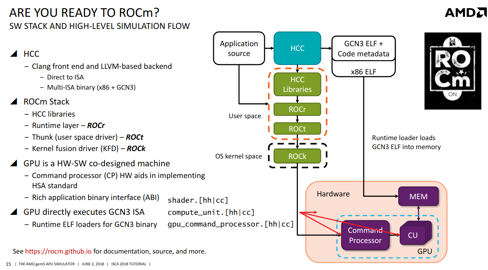
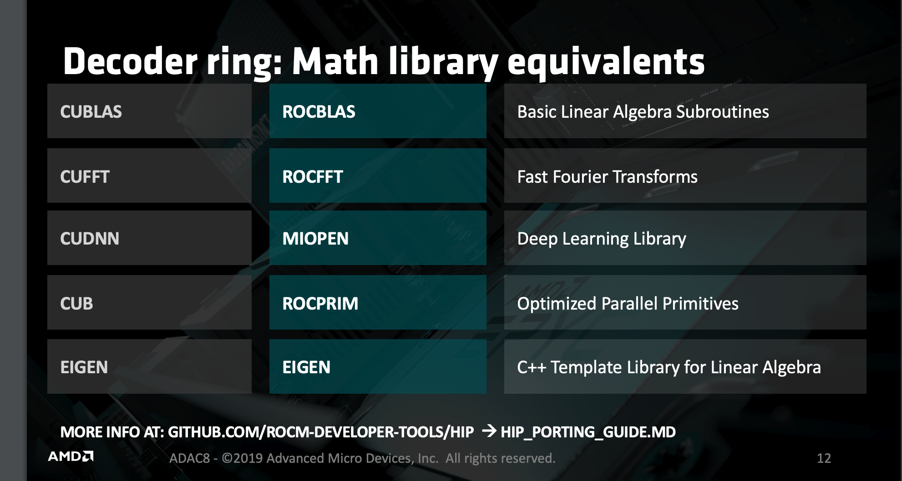
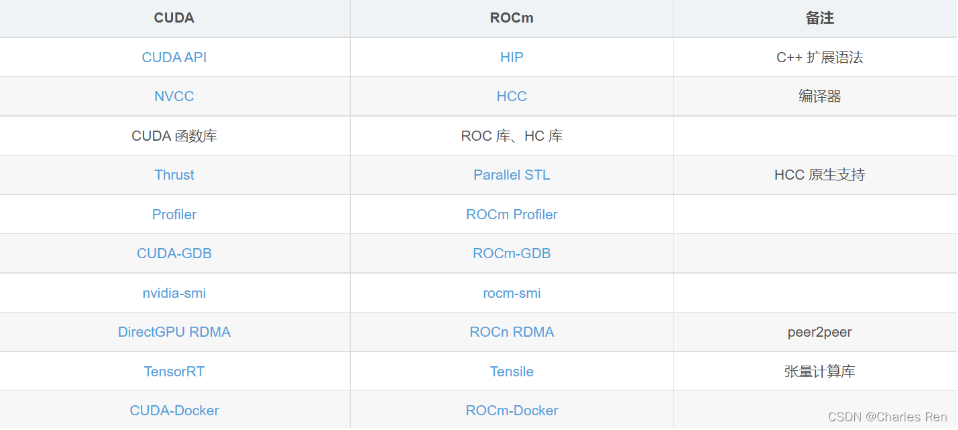
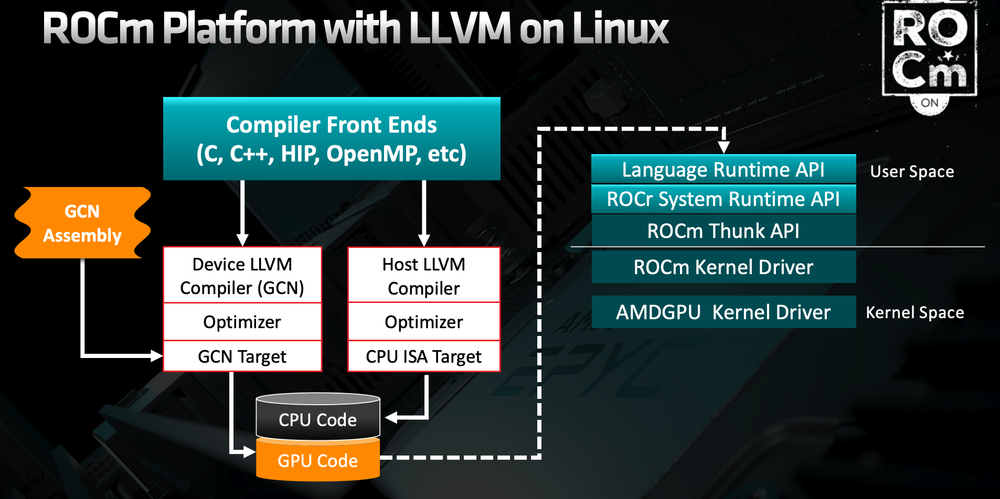

# ROCm简介 #
ROCm(RadeonOpenCompute)是一个开源软件堆栈，主要由开源软件(OSS)组成，设计用于图形处理单元(GPU)计算。ROCm由一组驱动程序、开发工具和api组成，支持从低级内核到最终用户应用程序的GPU编程。使用ROCm，您可以自定义GPU软件以满足您的特定需求。您可以在免费、开源、集成和安全的软件生态系统中开发、协作、测试和部署您的应用程序。
## 名词解释 ##
### MIOpen ##
AMD高性能机器学习原语库（AMD's library for high performance machine learning primitives），MIOpen支持两种编程模型HIP和OpenCL，对标cudann
### HIP ###
HIP：HIP是C++运行环境的API；一种kenerl语言，可用于编写可移植性程序，无关于硬件显卡种类
### HSA ###
HSA——Heterogeneous system architecture，可以简单理解为硬件上的一层抽象。 AMD 等为支持 CPU+GPU 混合计算生态而成立了非赢利组织 HSA 基金，提供 runtime 和架构 API 标准。现成员包括 AMD、三星、高通、ARM、TI、Imagination、MTK等。
### GCN ###
GCN——Graphics Core Next，是 AMD 11年推出的全新架构，以区别于之前基于基于 VLIW （超长指令字）的架构。由于现在所有 AMD GPU 都建于 GCN 架构，失去 ”next“ 的对象，因此，GCN 可以简单理解为 AMD GPU 架构
### hip-clang ###
在 ROCM v3.5 版本之前使用的编译器是 HCC，在之后的版本中被弃用，并且引入了 HIP-Clang 编译器来编译 HIP 程序。AMD 公司逐渐不去使用 HCC 编译器了，转而去研发 HIP 和 支持异构计算的其他语言，现在对于 HCC 不会再去发展新的特性了，也不会去维护了。
* 编译HIP代码
* hcc是clang的一种fork
* It understands HIP and emits AMDGCN in the resulting
binary
* hipcc -> hcc (clang) -> amdgcn
* All the x86 pieces are dealt with in the same way
### AOMP (AMD OpenMP Compiler) ### 
* Compiles C/C++ code with OpenMP “target” pragmas
* Links with libomptarget to produce a binary that can offload work to the GPU
### OpenCL ###
Khronos Industry Standard accelerator language 

在实际应用中，GCN架构的AMD显卡通常符合HSA标准，这意味着它们能够更好地与其他HSA兼容的处理器（如AMD CPU）协同工作，共享内存和任务调度，从而提高整体性能。

#编译器
ROCM相当于是HSA的一种实现
GCN3是GPU的接口

# ROCm 和 CUDA对比 #
A卡上编程模型使用的是HIP或者OpenCL，而运行环境是ROCm
N卡上，编程模型是CUDA，运行环境也是CUDA

[源码编译hip](https://rocm.docs.amd.com/projects/HIP/en/latest/developer_guide/build.html)

    rocFFT：快速傅里叶变换库，用于加速频域计算任务。
    rocBLAS：基本线性代数子程序库，用于加速矩阵计算任务。
    rocRAND：随机数生成库，用于生成随机数序列。
    rocSPARSE：稀疏矩阵计算库，用于加速稀疏矩阵计算任务。