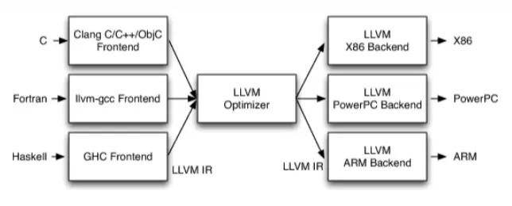

# GCC #
GCC（GNU Compiler Collection）是一套有GNU开发的编程语言编译器，以GPL及LGPL许可证所发行的自由软件。GCC原名为GNU C 语言编译器，它原本只能处理C语言，随着技术的发展，GCC很快地得到扩展，变得可以处理C++，之后可以处理的语言扩展到Fortran、Pascal、Objective-C、Java等。

# LLVM架构 ##

* 不同的前端后端使用统一的中间代码LLVM Intermediate Representation (LLVM IR)
* 如果需要支持一种新的编程语言，那么只需要实现一个新的前端
* 如果需要支持一种新的硬件设备，那么只需要实现一个新的后端
* 优化阶段是一个通用的阶段，它针对的是统一的LLVM IR，不论是支持新的编程语言，还是支持新的硬件设备，都不需要对优化阶段做修改
* 相比之下，GCC的前端和后端没分得太开，前端后端耦合在了一起。所以GCC为了支持一门新的语言，或者为了支持一个新的目标平台，就 变得特别困难
* LLVM现在被作为实现各种静态和运行时编译语言的通用基础结构(GCC家族、Java、.NET、Python、Ruby、Scheme、Haskell、D等)
# 什么是Clang ##
LLVM项目的一个子项目，基于LLVM架构的C/C++/Objective-C编译器前端。
相比于GCC，Clang具有如下优点
编译速度快:在某些平台上，Clang的编译速度显著的快过GCC(Debug模式下编译OC速度比GGC快3倍)
占用内存小:Clang生成的AST所占用的内存是GCC的五分之一左右
模块化设计:Clang采用基于库的模块化设计，易于 IDE 集成及其他用途的重用
诊断信息可读性强:在编译过程中，Clang 创建并保留了大量详细的元数据 (metadata)，有利于调试和错误报告
设计清晰简单，容易理解，易于扩展增强

# Clang和LLVM ##

LLVM整体架构，前端用的是clang，广义的LLVM是指整个LLVM架构，一般狭义的LLVM指的是LLVM后端（包含代码优化和目标代码生成）。

源代码（c/c++）经过clang--> 中间代码(经过一系列的优化，优化用的是Pass) --> 机器码
CLang是一个由C++编写的编译器前端，能够编译C/C++/Objective等高级语言，属于LLVM的一部分，发布于BSD（自由软件中使用最广发的许可证之一）许可证下，其目的就是为了超越GCC。经过测试证明，Clang编译Objective-C代码的速度为GCC的3倍左右，同时它还能针对用户发生的编译错误准确地给出建议。

# Clang和GCC的区别 #

* Clang比GCC编译用的时间更短，包括预处理、语法分析、解析、语义分析、抽象语法树生成的时间。
* Clang比GCC的内存占用更小。
* Clang生成的中间产物比GCC更小。
* Clang的错误提示比GCC更加友好。
* Clang有静态分析，GCC没有。
* Clang使用BSD许可证，GCC使用GPL许可证。
* Clang从一开始就被设计为一个API，允许它被源代码分析工具和IDE集成。GCC被构建成一个单一的静态编译器，这使得它非常难以被作为API并集成到其他工具中。
* GCC比Clang支持更多的语言，例如Java。
* GCC比Clang支持更多的平台。
* GCC比Clang更流行。
